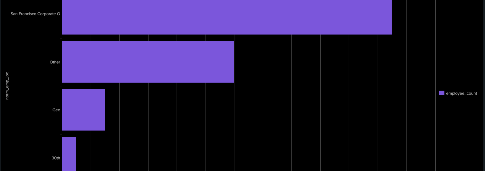
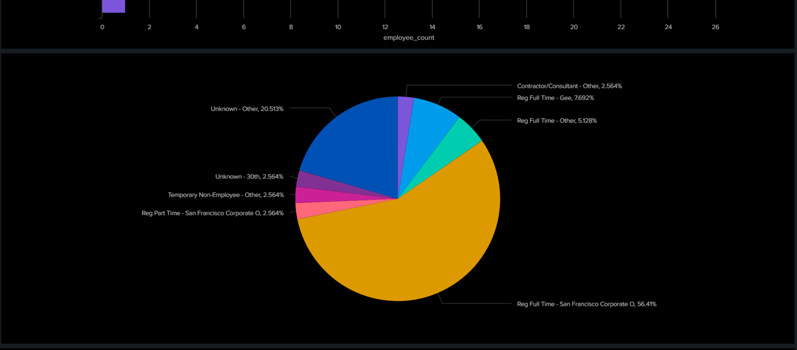
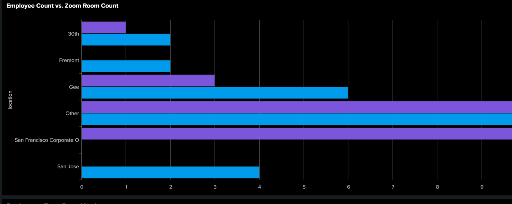

# Zoom License Utilization Analysis
**Organization:** OnLok Healthcare · San Francisco, CA  
**Tools:** Splunk, Splunk SPL, SQL  
**Outcome:** 40% reduction in unnecessary Zoom license costs

---

## Overview

OnLok Healthcare was overspending on Zoom licenses across multiple departments and office locations. Many licenses were assigned to employees who rarely used Zoom or were located at sites with existing Zoom Rooms available — meaning individual licenses were redundant.

I was tasked with analyzing Zoom usage patterns across the HR department to identify which licenses were underutilized and build a business case for reallocation.

---

## What I Did

- Connected to raw Zoom event log data and built structured SPL (Splunk Search Processing Language) queries to aggregate usage at the department and employee level
- Engineered metrics including meeting frequency, meeting duration, Zoom Room availability by location, and employment type to identify reallocation candidates
- Built an interactive Splunk dashboard to visualize license utilization patterns across office locations and employee categories
- Delivered a prioritized list of license reassignment recommendations to the IT and operations teams based on behavioral and location signals

---

## Dashboard Visuals

> *All employee-level data has been anonymized. Visuals show department and location-level aggregates only.*

### Employee Count by Office Location
Breaks down how HR employees are distributed across OnLok's office locations. Used to cross-reference where Zoom Rooms already existed versus where individual licenses were the only option.

---

### License Type Breakdown by Employment Category
Shows the distribution of Zoom license types by employee category. This helped identify employee segments where license types were mismatched to actual usage needs.

---

### Employee Count vs. Zoom Room Count by Location
The key insight visualization — comparing how many employees are at each location versus how many Zoom Rooms are available. Locations where Zoom Room count was sufficient relative to headcount were flagged as candidates for individual license removal.

---

## Results

| Metric | Outcome |
|---|---|
| License cost reduction | **40%** |
| Method | Behavioral + location-based reallocation analysis |
| Stakeholders | IT Team, Operations, Senior Leadership |

---

## Key Takeaways

- Location-aware analysis was critical — an employee at a site with 6 Zoom Rooms has very different license needs than one at a remote site with none
- Employment type (contractor vs. full-time) was a strong predictor of Zoom usage frequency
- Building reusable SPL queries meant the dashboard could be refreshed periodically, not just used as a one-time analysis
