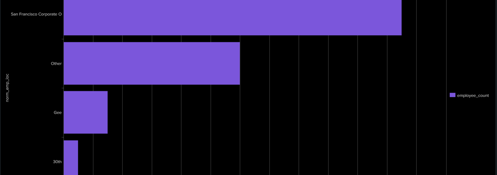
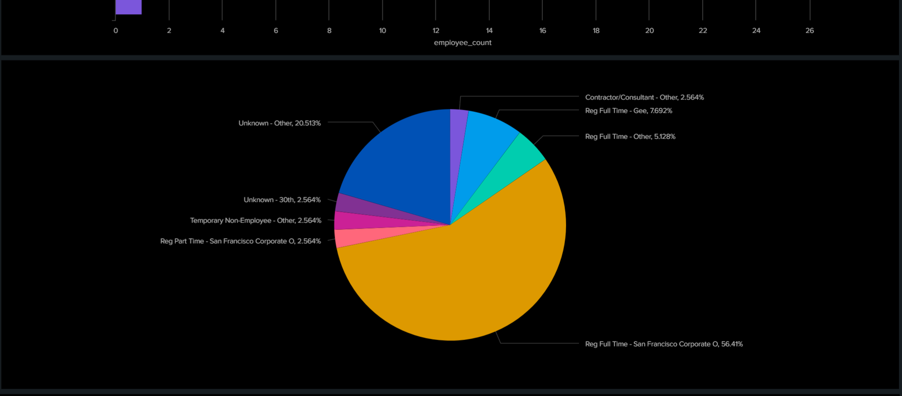
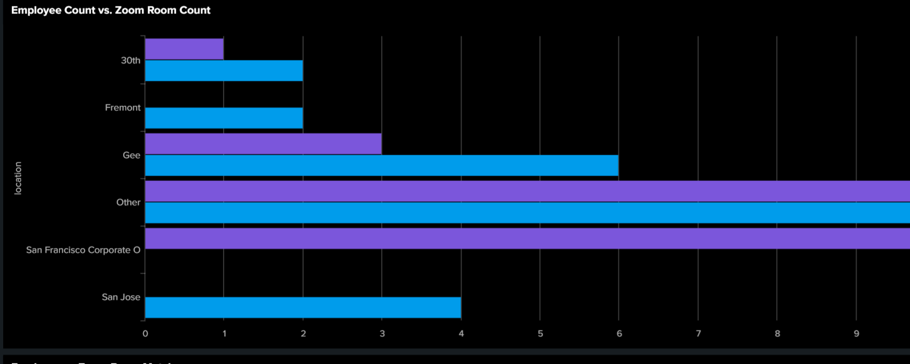

# Zoom License Utilization Analysis
**Organization:** OnLok Healthcare · San Francisco, CA  
**Tools:** Splunk, Splunk SPL, SQL  
**Outcome:** 40% reduction in unnecessary Zoom license costs

---

## Overview

OnLok Healthcare was overspending on Zoom licenses across multiple departments and office locations. Many licenses were assigned to employees who rarely used Zoom or were located at sites with existing Zoom Rooms available — meaning individual licenses were redundant.

I was tasked with analyzing Zoom usage patterns across the HR department to identify which licenses were underutilized and build a business case for reallocation.

---

## What I Did

- Connected to raw Zoom event log data and built structured SPL (Splunk Search Processing Language) queries to aggregate usage at the department and employee level
- Engineered metrics including meeting frequency, meeting duration, Zoom Room availability by location, and employment type to identify reallocation candidates
- Built an interactive Splunk dashboard to visualize license utilization patterns across office locations and employee categories
- Delivered a prioritized list of license reassignment recommendations to the IT and operations teams based on behavioral and location signals

---

## Dashboard Visuals

> *All employee-level data has been anonymized. Visuals show department and location-level aggregates only.*

### Employee Count by Office Location
Breaks down how HR employees are distributed across OnLok's office locations. Used to cross-reference where Zoom Rooms already existed versus where individual licenses were the only option.



---

### HR Employee Distribution by Employment Category and Location

Shows how HR department employees are distributed across employment types 
and office locations. Assuming all HR employees were provisioned a Zoom Pro 
license — the standard at OnLok — this breakdown helped identify which 
segments were reallocation candidates.

Notable findings:
- **Reg Full Time – SF Corporate Office** made up **56.41%** of the pool —
the largest segment by far
- The remaining ~44% spans contractors, part-time, temporary, and unknown 
employee types — each with different meeting needs

Understanding who is in the license pool — and what type of employee they 
are — is the first step in figuring out who actually needs a Pro license. 
This sets up the key question: does their office have the infrastructure to 
support shared meeting spaces instead?



---

### Employee Count vs. Zoom Room Count by Location
The key insight visualization — comparing how many employees are at each location versus how many Zoom Rooms are available. Locations where Zoom Room count was sufficient relative to headcount were flagged as candidates for individual license removal.

Compares headcount against Zoom Room availability at each office location. 
Note that headcounts reflect HR department employees only — not total building 
occupancy — as this analysis was scoped to HR as a pilot. Locations where 
Zoom Room count was high relative to HR headcount were flagged as candidates 
for individual license removal.



---

## Results

| Metric | Outcome |
|---|---|
| Projected license cost reduction | **40%** |
| Method | Behavioral + location-based reallocation analysis |
| Stakeholders | IT Team, Operations, Senior Leadership |

> **Note:** The 40% represents a projected cost reduction based on the reallocation model. The analysis and recommendations were delivered to IT and Operations leadership at the conclusion of the internship — implementation occurred after my tenure.

### How the 40% Was Projected

Reallocation candidates were identified using a two-signal model:

1. **Zoom Room Coverage Ratio** — Zoom Rooms ÷ Employees at that building. Locations with a high ratio already had sufficient shared meeting infrastructure, making individual licenses redundant.
2. **Individual Usage Frequency** — Employees with below-median meeting activity were flagged as low-utilization users.

Licenses where **both signals were true** were marked for reallocation. The cost projection followed:

```
Flagged Licenses × Avg Annual License Cost = Projected Savings
Projected Savings ÷ Total License Spend = % Reduction
```

The flagged pool represented approximately 40% of total license spend in the analyzed cohort.

---

## Key Takeaways

- Location-aware analysis was critical — an employee at a site with 6 Zoom Rooms has very different license needs than one at a remote site with none
- Employment type (contractor vs. full-time) was a strong predictor of Zoom usage frequency
- Building reusable SPL queries meant the dashboard could be refreshed periodically, not just used as a one-time analysis
